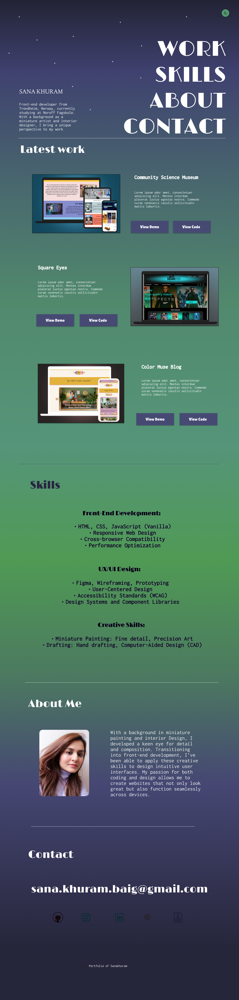
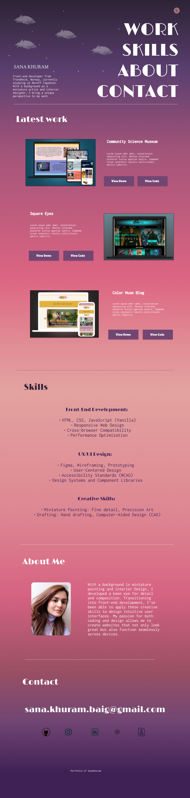

# 🌟 Sana Khuram Portfolio

Welcome to my portfolio! This project showcases my work as a **Front-End Developer** along with details about my skills, projects, and background. The site is built with **HTML**, **JS**, and **CSS**, focusing on creating a visually engaging and responsive layout that works in both **light** and **dark** modes.

## 📑 Table of Contents

1. [About the Project](#about-the-project)
2. [Features](#features)
3. [🚀 Live Demo](#live-demo)
4. [🛠️ Installation](#installation)
5. [📸 Screenshots](#screenshots)
   - [Dark Mode & Light Mode](#dark-mode--light-mode)
6. [🧰 Technologies Used](#technologies-used)
7. [📞 Contact](#contact)

## 📝 About the Project

This portfolio website provides a detailed overview of my latest work, skills, and background in front-end development. It includes interactive elements such as a **light/dark mode toggle** and animations for a better user experience. The website is fully responsive, ensuring accessibility across different devices and screen sizes.

## ✨ Features

- **Responsive Design**: Adapts to different screen sizes (desktop, tablet, mobile).
- **Light/Dark Mode**: Users can toggle between light and dark themes. 🌞🌛
- **Interactive Animations**: Includes animations for clouds, stars, and auroras to enhance visual appeal. 🌟
- **Smooth Scrolling**: Easy navigation with smooth scrolling and a "Back to Top" button. 🔝
- **Accessible Layout**: Ensures compliance with accessibility standards, including color contrast and font readability. 🦾

## 🚀 Live Demo

You can view the live demo of this portfolio at the following link:

[**Live Demo**](https://portfolio-sanakh.netlify.app/) 

## 📸 Screenshots

### Dark Mode & Light Mode:

<div align="center">
  
  
</div>

## 🛠️ Installation

To run this project locally:

1. Clone this repository:
    ```bash
    git clone https://github.com/sanakhuram/portfolio.git
    ```

2. Navigate into the project directory:
    ```bash
    cd portfolio
    ```

3. Open the `index.html` file in your browser to view the portfolio.

## 🧰 Technologies Used

- **HTML5** 📄
- **CSS3** 🎨
- **JavaScript** (for light/dark mode toggle and animations) ⚙️
- **Font Awesome** (for icons) 🔗
- **Google Fonts** (for typography) ✍️
- **Responsive Design** (media queries) 📱

## 📞 Contact

Feel free to reach out to me if you have any questions or would like to collaborate on a project!

- **📧 Email**: [sana.khuram.baig@gmail.com](mailto:sana.khuram.baig@gmail.com)
- **💼 LinkedIn**: [Sana Khuram](https://www.linkedin.com/in/sana-khuram-157ba02b7/)
- **🐙 GitHub**: [sanakhuram](https://github.com/sanakhuram)
- **📸 Instagram**: [@sana_khuram](https://www.instagram.com/sana_khuram?igsh=MTBneHhvd2d2eXB2dg==)
